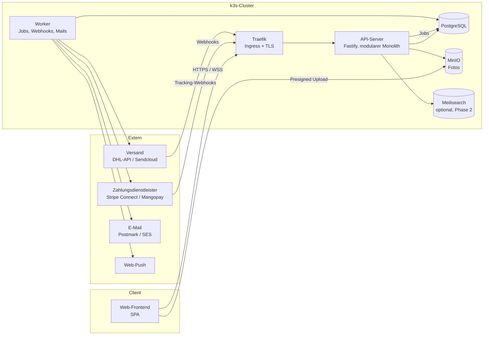
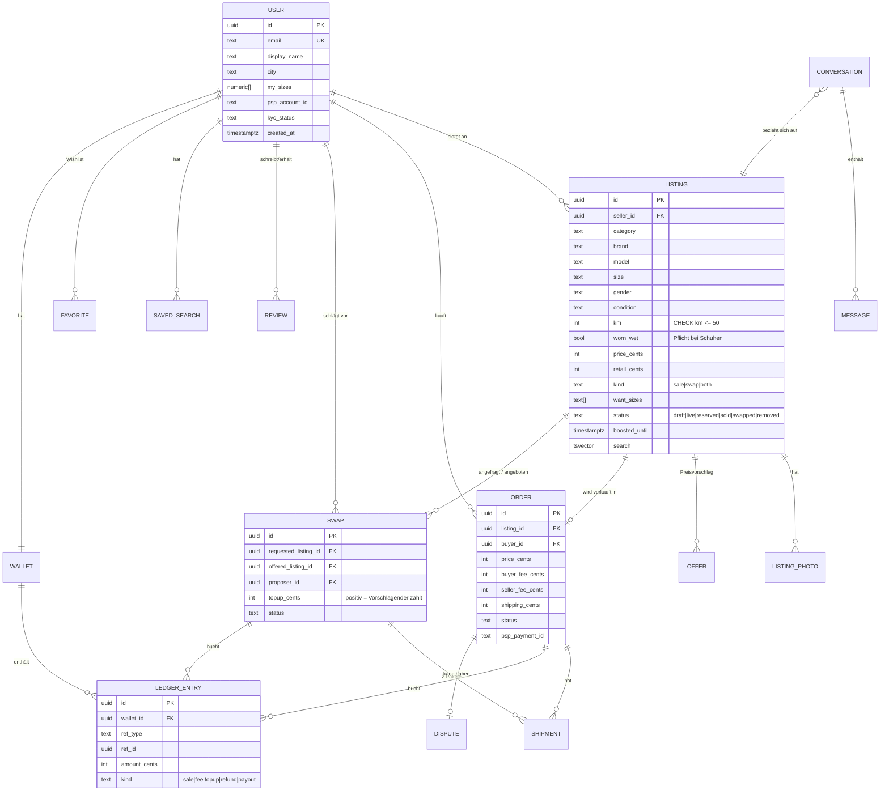
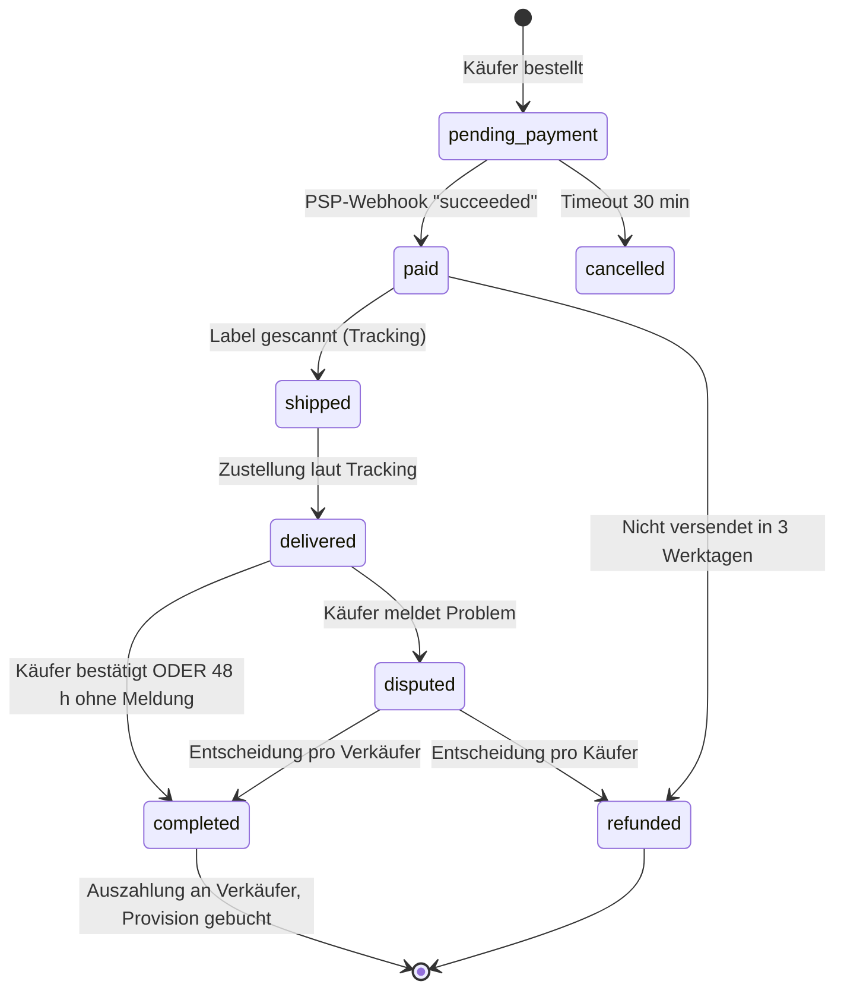
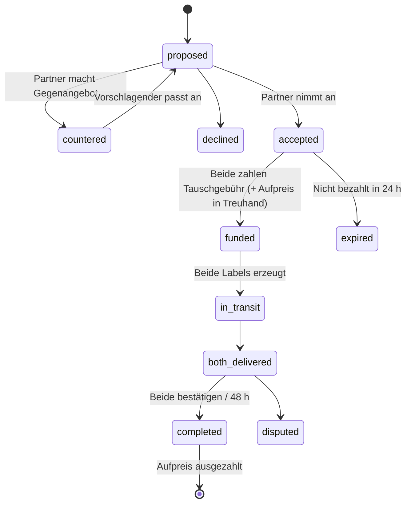
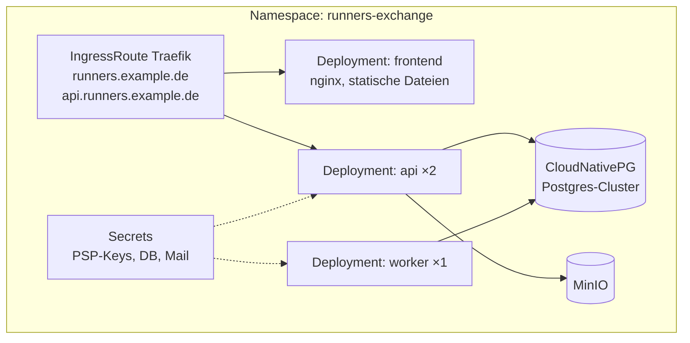

# Backend-Architektur – Runners Exchange

Entwurf für das Backend zum bestehenden Frontend. Ziel: klein anfangen, selbst hosten (k3s + Traefik), später skalieren können.

## 1. Grundentscheidung: modularer Monolith

Ein einziger Backend-Dienst mit klar getrennten Modulen statt Microservices. Bei einem Marktplatz im Start gibt es wenig Last, aber viel Fachlogik (Treuhand, Tausch, Gebühren). Ein Monolith ist einfacher zu betreiben, zu testen und zu debuggen. Die Modulgrenzen sind so gezogen, dass man einzelne Module später herauslösen kann (Kandidaten: Suche, Benachrichtigungen).

**Stack**

| Bereich | Wahl | Begründung |
|---|---|---|
| Sprache/Framework | TypeScript + Fastify | Gleiche Sprache wie das Frontend, schnell, gute Schema-Validierung |
| Datenbank | PostgreSQL 16 | Transaktionen für Geldflüsse, Volltextsuche reicht am Anfang |
| ORM/Migrationen | Drizzle oder Prisma | Typsichere Queries, versionierte Migrationen |
| Jobs & Queue | pg-boss (Queue in Postgres) | Kein zusätzlicher Dienst; später Redis/BullMQ |
| Dateien (Fotos) | S3-kompatibel (MinIO selbst gehostet) | Direkt-Upload per Presigned URL |
| Echtzeit (Chat) | WebSocket (Fastify-Plugin) | Chat und Live-Status von Tausch/Bestellung |
| Suche | Postgres `tsvector` → später Meilisearch | Erst einfach, dann Tippfehler-Toleranz/Facetten |
| Auth | Eigene Sessions (HttpOnly-Cookie) oder Keycloak/Authentik | Magic-Link + Passkeys, kein Passwortzwang |

## 2. Systemübersicht



API und Worker sind dasselbe Container-Image, nur mit anderem Startbefehl.

## 3. Module

| Modul | Aufgabe | Frontend-Seiten |
|---|---|---|
| **identity** | Registrierung, Login (Magic-Link/Passkey), Sessions, Profil, Verifizierung (KYC über PSP) | Konto › Einstellungen |
| **catalog** | Inserate anlegen/ändern, Zustand, Größen, Fotos, Moderation | Verkaufen, Artikel, Konto › Inserate |
| **search** | Filter, Sortierung, Suchaufträge, Größen-Matching | Marktplatz, Tauschbörse |
| **pricing** | Gebührenberechnung (heute `FEES` in `data.js`) – **einzige Quelle der Wahrheit** | Überall, wo Preise stehen |
| **orders** | Kauf, Preisvorschläge, Treuhand-Status, Reklamation | Kasse, Bestellungen |
| **swaps** | Tauschvorschlag, Gegenangebot, Aufpreis, beidseitige Bestätigung | Tausch vorschlagen, Konto › Tausch |
| **payments** | Anbindung PSP: Zahlung, Treuhand, Auszahlung, Erstattung, Webhooks | Kasse, Auszahlung |
| **shipping** | Versandlabel erzeugen, Tracking, Zustellbestätigung | Versandlabel, Bestellstatus |
| **messaging** | Unterhaltungen, Nachrichten, Systemnachrichten, WebSocket | Nachrichten |
| **reviews** | Bewertungen nach Abschluss, Durchschnittswerte | Verkäuferprofil |
| **notifications** | E-Mail, Push, In-App; ausgelöst durch Domain-Events | Suchauftrag, Match-Hinweise |
| **admin** | Moderation, Streitfälle, Gebührenreport, Sperren | (eigenes Admin-UI, später) |

**Regel:** Module sprechen nur über ihre Service-Schnittstelle oder über Domain-Events miteinander, nie direkt in fremde Tabellen.

## 4. Datenmodell



Wichtig:
- **Geld immer als Integer in Cent**, nie als Float.
- **Plattformregeln in der Datenbank absichern:** `CHECK (km <= 50)` und `worn_wet NOT NULL` für Schuh-Kategorien, nicht nur im Frontend prüfen.
- **Gebühren werden bei Bestellung eingefroren** (`buyer_fee_cents`, `seller_fee_cents`). Spätere Änderungen an `FEES` betreffen alte Bestellungen nicht.
- **Ledger (Buchungsjournal)**: Jede Geldbewegung ist eine unveränderliche Zeile. Das Guthaben ist die Summe der Zeilen. So bleibt alles nachvollziehbar, auch für Steuer und DAC7.

## 5. Kernabläufe als Zustandsmaschinen

### Kauf mit Käuferschutz



Das Inserat wird bei `pending_payment` **reserviert**, damit es nicht doppelt verkauft wird (Row-Lock / `UPDATE … WHERE status='live'`).

### Tausch mit Treuhand



Beide Inserate sind ab `accepted` reserviert.

## 6. API-Entwurf (REST, JSON)

```
POST   /auth/magic-link              GET  /me              PATCH /me
GET    /listings?q=&cat=&size=&cond=&kind=&max=&sort=&cursor=
GET    /listings/:id                 POST /listings        PATCH /listings/:id
POST   /listings/:id/photos/upload-url                     POST  /listings/:id/boost
POST   /listings/:id/offers          POST /offers/:id/accept|decline
GET    /matches                      (Tausch-Matches zu my_sizes)
POST   /swaps                        POST /swaps/:id/accept|decline|counter|confirm
POST   /orders                       (→ liefert PSP-Client-Secret)
POST   /orders/:id/confirm-receipt   POST /orders/:id/dispute
GET    /orders?role=buyer|seller     GET  /shipments/:id/label
GET    /conversations                GET  /conversations/:id/messages
WS     /ws                           (Chat, Statusänderungen)
GET    /favorites  PUT/DELETE /favorites/:listingId
GET    /saved-searches  POST /saved-searches
GET    /wallet     POST /wallet/payout
GET    /fees/quote?price=            (Frontend holt Gebühren vom Server)
POST   /webhooks/psp                 POST /webhooks/shipping
```

- Eingaben/Ausgaben per JSON-Schema (TypeBox) validiert. Daraus wird eine OpenAPI-Datei generiert, aus der wiederum der Frontend-Client erzeugt wird.
- Paginierung per Cursor, nicht per Offset.
- Schreibende Zahlungsaufrufe mit `Idempotency-Key`-Header.

## 7. Zahlungen: der kritischste Teil

**Das Geld darf nicht auf dem eigenen Konto zwischengeparkt werden.** Wer fremdes Geld treuhänderisch hält und weiterleitet, braucht in Deutschland eine BaFin-Erlaubnis (ZAG). Lösung: Ein **Marktplatz-Zahlungsdienstleister** übernimmt Treuhand, KYC der Verkäufer und Auszahlung:

| Anbieter | Pro | Contra |
|---|---|---|
| **Stripe Connect** (Express-Konten) | Beste Doku, schnell integriert, `application_fee` = Provision | Gebühren etwas höher |
| **Mangopay** | Speziell für Marktplätze/Treuhand, in EU verbreitet (Vinted-ähnlich) | Aufwendigere Integration |
| Adyen for Platforms | Sehr mächtig | Erst ab größerem Volumen sinnvoll |

Empfehlung für den Start: **Stripe Connect** mit „separate charges and transfers“: Käufer zahlt an die Plattform, nach `completed` wird per Transfer an den Verkäufer ausgezahlt, die Provision bleibt einfach übrig.

Geldfluss bei einem Schuh für 100 €:

```
Käufer zahlt 111,19 €  = 100,00 Artikel + 5,70 Käuferschutz + 5,49 Versand
 ├─ an Verkäufer:  95,00 €   (100 − 5 % Provision)
 ├─ an Versand:     5,49 €   (Label-Kosten)
 └─ Plattform:     10,70 €   brutto, abzgl. PSP-Gebühren (~1,5 % + 0,25 €) ≈ 9,00 € netto
```

## 8. Querschnittsthemen

**Sicherheit**
- Sessions als HttpOnly/SameSite-Cookie, CSRF-Schutz, Rate-Limit (Login, Nachrichten, Angebote)
- Webhooks nur mit Signaturprüfung; jede Webhook-ID nur einmal verarbeiten
- Foto-Upload: nur Presigned URLs, Größen- und Typprüfung, EXIF-Daten entfernen (GPS!)
- Chat: Filter gegen „zahl doch per PayPal Freunde“ (Betrugsprävention)

**Recht & Compliance**
- **DAC7 / PStTG**: Plattformen müssen Verkäufer ab 30 Verkäufen oder 2.000 € im Jahr ans BZSt melden → Steuer-ID beim Onboarding abfragen, Jahresreport aus dem Ledger
- **DSGVO**: Datenexport und Löschung pro Nutzer, Auftragsverarbeitungsverträge mit PSP, Mail- und Versanddienst
- **DSA** (Digital Services Act): Meldeweg für illegale Inhalte, Begründung bei Sperrungen
- Impressum und AGB mit Plattformregeln (u. a. „max. 50 km“, Pflichtangabe „nass getragen“, kein Handel außerhalb der Plattform)

**Betrieb**
- Logs strukturiert (pino) → Loki; Metriken → Prometheus/Grafana; Fehler → Sentry/GlitchTip
- Tägliche Postgres-Backups (pgBackRest oder CloudNativePG), Wiederherstellung regelmäßig testen
- Health-Endpoints `/healthz` und `/readyz` für k3s-Probes

## 9. Deployment auf k3s



- TLS über Traefik + cert-manager / Let's Encrypt
- Secrets per SOPS oder Sealed Secrets im Git
- CI: Tests → Image bauen → Migrationen als Job vor dem Rollout → Rollout
- Die PSP-Webhooks brauchen eine öffentlich erreichbare URL. Falls der Cluster zu Hause läuft: Cloudflare Tunnel o. Ä.

## 10. Projektstruktur

```
backend/
  src/
    modules/
      identity/   catalog/   search/   pricing/   orders/
      swaps/      payments/  shipping/ messaging/ reviews/
      notifications/  admin/
        ├─ routes.ts      (HTTP)
        ├─ service.ts     (Fachlogik)
        ├─ repo.ts        (DB-Zugriff)
        ├─ events.ts      (Domain-Events)
        └─ *.test.ts
    shared/   (db, auth, errors, money, event-bus)
    server.ts   worker.ts
  migrations/
  openapi.json
```

## 11. Umsetzungsreihenfolge

| Phase | Inhalt | Ergebnis |
|---|---|---|
| **1 – MVP Kaufen** | identity, catalog, pricing, einfache Suche, orders, Stripe Connect, manuelle Versandnummer, E-Mail | Man kann echt kaufen und verkaufen |
| **2 – Vertrauen** | Versandlabel-API + Tracking, Bewertungen, Chat, Reklamation, Admin-Moderation | Käuferschutz läuft automatisch |
| **3 – Tausch** | swaps inkl. Treuhand-Aufpreis, Größen-Matching, Suchaufträge, Push | Alleinstellungsmerkmal live |
| **4 – Wachstum** | Meilisearch, Boost, DAC7-Report, Auswertungen, ggf. App | Skalierung und zusätzliche Einnahmen |

Tauschen erst in Phase 3, weil es die komplexeste Geldlogik hat (zwei Pakete, zwei Zahlungen, Aufpreis) und auf allen Bausteinen aus Phase 1 und 2 aufsetzt.
